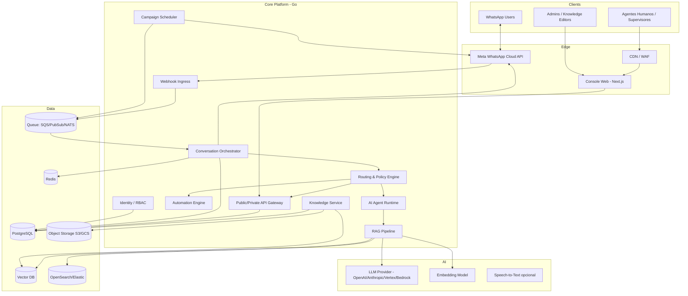
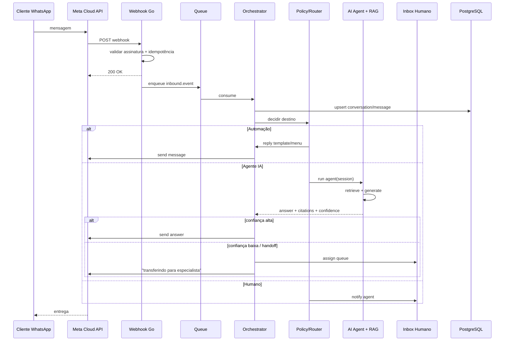
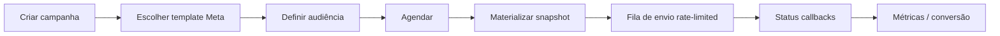
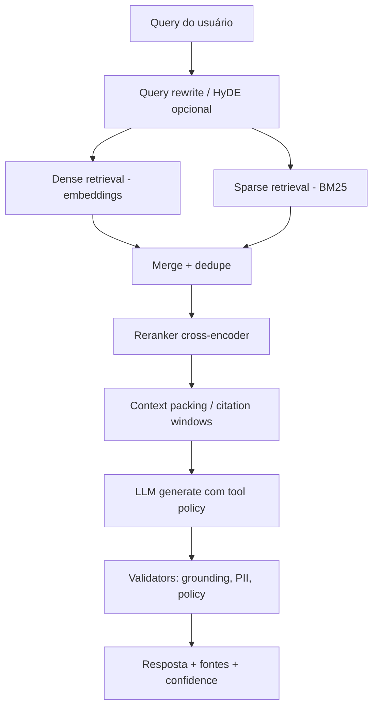
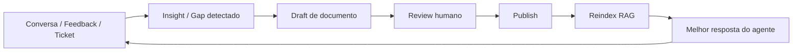
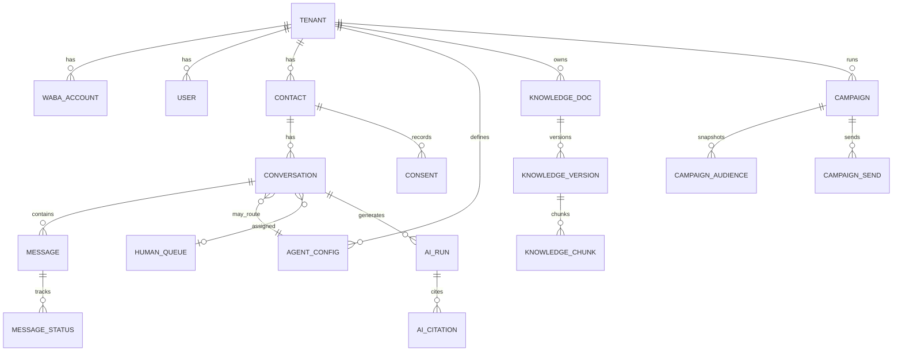

# Central de Contato WhatsApp com Agentes de IA e RAG

**Documento de Arquitetura Técnica e de Produto**  
**Versão:** 1.0  
**Stack principal:** Go (Golang)  
**Canal:** WhatsApp Business Platform (Cloud API / Meta)  
**Status:** Proposta técnica completa para implementação

---

## Sumário

1. [Visão e objetivos](#1-visão-e-objetivos)
2. [Escopo e não-escopo](#2-escopo-e-não-escopo)
3. [Requisitos funcionais](#3-requisitos-funcionais)
4. [Requisitos não funcionais](#4-requisitos-não-funcionais)
5. [Arquitetura de referência](#5-arquitetura-de-referência)
6. [Componentes detalhados](#6-componentes-detalhados)
7. [Integração WhatsApp](#7-integração-whatsapp)
8. [Respostas automáticas e roteamento](#8-respostas-automáticas-e-roteamento)
9. [Schedules, campanhas e promoções](#9-schedules-campanhas-e-promoções)
10. [Agentes de IA e RAG](#10-agentes-de-ia-e-rag)
11. [Evolução do conhecimento interno](#11-evolução-do-conhecimento-interno)
12. [Agentes pré-configurados](#12-agentes-pré-configurados)
13. [Modelo de dados](#13-modelo-de-dados)
14. [APIs e contratos](#14-apis-e-contratos)
15. [Estrutura do monorepo em Go](#15-estrutura-do-monorepo-em-go)
16. [Infraestrutura: AWS vs GCP vs híbrido](#16-infraestrutura-aws-vs-gcp-vs-híbrido)
17. [Segurança, LGPD e compliance](#17-segurança-lgpd-e-compliance)
18. [Observabilidade e SRE](#18-observabilidade-e-sre)
19. [Capacidade, limites e custo](#19-capacidade-limites-e-custo)
20. [Roadmap de implementação](#20-roadmap-de-implementação)
21. [Riscos e mitigações](#21-riscos-e-mitigações)
22. [Decisões técnicas (ADRs)](#22-decisões-técnicas-adrs)
23. [Checklist de prontidão para produção](#23-checklist-de-prontidão-para-produção)
24. [Apêndices](#24-apêndices)

---

## 1. Visão e objetivos

### 1.1 Problema

Empresas precisam atender clientes no WhatsApp com consistência, escala e rastreabilidade. Operações manuais não escalam; bots engessados não resolvem dúvidas complexas; e bases de conhecimento ficam desatualizadas, degradando a qualidade das respostas.

### 1.2 Visão do produto

Uma **Central de Contato omnichannel-ready**, iniciando pelo WhatsApp, que unifica:

- **Inbox unificado** (humano + bot + IA)
- **Automações** (respostas automáticas, menus, regras)
- **Campanhas agendadas** (promoções, lembretes, reativação)
- **Agentes de IA** com **RAG** sobre documentação interna
- **Ciclo de aprendizado** (feedback → documentos → reindexação → melhor resposta)
- **Agentes especializados pré-configurados** (vendas, suporte, financeiro, onboarding)

### 1.3 Objetivos de negócio (OKRs sugeridos)

| Objetivo | Métrica |
|---|---|
| Reduzir tempo de primeira resposta (FRT) | P50 < 5s (bot/IA), P95 < 30s |
| Aumentar resolução automatizada | ≥ 40% dos tickets resolvidos sem humano (após 90 dias) |
| Manter qualidade | CSAT ≥ 4.2/5 nas conversas com IA |
| Governança de conhecimento | ≤ 7 dias entre mudança de doc e disponibilidade no RAG |
| Compliance | 100% das conversas com retenção e consentimento auditáveis |

### 1.4 Princípios de desenho

1. **Event-driven first** — webhooks Meta → fila → workers (nunca processamento síncrono longo no webhook).
2. **Human-in-the-loop** — IA sugere/responde, humano assume a qualquer momento.
3. **Knowledge as product** — documentação interna é pipeline de dados, não arquivo solto.
4. **Multi-tenant from day one** — isolamento por `tenant_id` (mesmo se começar com 1 cliente).
5. **Policy before model** — regras de negócio e compliance antes do LLM.
6. **Go na borda e no core** — latência previsível, concorrência barata, binários estáveis.

---

## 2. Escopo e não-escopo

### 2.1 Escopo (MVP → v1)

**MVP**

- Recepção/envio via WhatsApp Cloud API
- Inbox web para agentes humanos
- Automações básicas (saudação, horário comercial, FAQ fixa)
- Um agente de IA com RAG sobre docs internos
- Handoff humano ↔ IA
- Campanhas agendadas (templates Meta aprovados)
- Auditoria básica de mensagens

**v1**

- Múltiplos agentes pré-configurados por domínio
- Pipeline de ingestão/versionamento de conhecimento
- Avaliação contínua (offline + online) de qualidade do RAG
- Segmentação de clientes e A/B de campanhas
- Painel de analytics (funil, resolução, custo LLM)
- Webhooks outbound para CRM/ERP

### 2.2 Não-escopo (inicial)

- Canais além de WhatsApp (Instagram/SMS/e-mail) — arquitetura preparada, implementação depois
- Voice/calls WhatsApp
- Marketplace público de bots
- Treinamento de LLM próprio (fine-tune) — começa com modelos gerenciados + RAG
- App mobile nativo (usar PWA/web responsivo)

---

## 3. Requisitos funcionais

### 3.1 Conversação

| ID | Requisito |
|---|---|
| RF-01 | Receber mensagens (texto, imagem, áudio, documento, localização, botões, listas) |
| RF-02 | Enviar mensagens livres dentro da janela de 24h |
| RF-03 | Enviar templates aprovados fora da janela |
| RF-04 | Manter thread/conversa por cliente (`wa_id` + `tenant`) |
| RF-05 | Status de entrega/leitura (sent/delivered/read/failed) |
| RF-06 | Handoff: bot → IA → humano → IA |

### 3.2 Automações

| ID | Requisito |
|---|---|
| RF-10 | Respostas automáticas por palavra-chave / intent |
| RF-11 | Menu interativo (list/reply buttons) |
| RF-12 | Regras por horário, fila, tag, segmento |
| RF-13 | SLA e escalonamento automático |
| RF-14 | Quiet hours / opt-out / blocklist |

### 3.3 Campanhas e schedules

| ID | Requisito |
|---|---|
| RF-20 | Agendar envio único ou recorrente |
| RF-21 | Segmentação (tags, atributos, RFM, consentimento) |
| RF-22 | Throttling e respect a rate limits Meta |
| RF-23 | Relatório de entrega/abertura/clique (quando aplicável) |
| RF-24 | Cancelamento e pausa de campanha |

### 3.4 IA + RAG

| ID | Requisito |
|---|---|
| RF-30 | Agente responde com grounding em base interna |
| RF-31 | Citar fontes (doc/versão/chunk) quando possível |
| RF-32 | Recusar/escapar quando confiança baixa |
| RF-33 | Ferramentas (tools): consultar pedido, abrir ticket, etc. |
| RF-34 | Memória de sessão + resumo de conversa longa |
| RF-35 | Feedback 👍/👎 e correção humana → backlog de docs |

### 3.5 Conhecimento

| ID | Requisito |
|---|---|
| RF-40 | Ingestão de Markdown, PDF, Confluence/Notion/Drive |
| RF-41 | Versionamento semântico de documentos |
| RF-42 | Reindexação incremental |
| RF-43 | Políticas de acesso por tenant/agente/domínio |
| RF-44 | Review workflow (draft → approved → published) |

### 3.6 Agentes pré-configurados

| ID | Requisito |
|---|---|
| RF-50 | Catálogo de agentes (persona, tools, KB, tom, limites) |
| RF-51 | Roteamento por intent/departamento/palavra-chave |
| RF-52 | Cliente escolhe agente via menu ou deep-link |
| RF-53 | Sandbox de teste por agente |

### 3.7 Administração

| ID | Requisito |
|---|---|
| RF-60 | Multi-tenant (organizações, WABAs, números) |
| RF-61 | RBAC (admin, supervisor, agente, editor KB, viewer) |
| RF-62 | Auditoria de ações sensíveis |
| RF-63 | Configuração de provedores LLM por tenant |

---

## 4. Requisitos não funcionais

| ID | Categoria | Alvo |
|---|---|---|
| RNF-01 | Latência webhook ACK | < 3s (Meta exige resposta rápida) |
| RNF-02 | Latência resposta bot simples | P95 < 800ms |
| RNF-03 | Latência resposta IA+RAG | P95 < 4s (streaming quando possível) |
| RNF-04 | Disponibilidade | 99.9% mensal no path crítico (ingest/send) |
| RNF-05 | Durabilidade de eventos | ≥ 1 réplica, replay ≥ 7 dias |
| RNF-06 | Multi-tenant isolation | Row-level + storage isolation lógica |
| RNF-07 | Idempotência | Webhooks e envios deduplicados |
| RNF-08 | Observabilidade | Traces + métricas + logs estruturados |
| RNF-09 | Segurança | Segredos em KMS/Secret Manager; TLS 1.2+ |
| RNF-10 | LGPD | Consentimento, retenção, exclusão, DSR |
| RNF-11 | Escala | 100 msg/s sustentado no MVP; desenho para 1k+/s |
| RNF-12 | Custo previsível | Budgets e rate limits de LLM por tenant |

---

## 5. Arquitetura de referência

### 5.1 Diagrama lógico (C4 container)



### 5.2 Fluxo de mensagem inbound (happy path)



### 5.3 Estilo arquitetural

| Camada | Escolha | Motivo |
|---|---|---|
| Comunicação interna | Eventos + comandos (outbox) | Desacoplamento, retry, auditoria |
| Serviços | Modular monolith **ou** poucos serviços Go | MVP rápido; extrair depois por domínio quente |
| Contratos | Protobuf/JSON Schema + OpenAPI | Tipagem forte no core |
| Estado conversacional | PostgreSQL + Redis (hot session) | Consistência + baixa latência |
| Conhecimento | Object storage + vector DB + search lexical | RAG híbrido (dense + sparse) |

**Recomendação de partida:** *modular monolith* em Go (um deploy) com pacotes por bounded context, filas externas e workers no mesmo binário (`cmd/api`, `cmd/worker`, `cmd/scheduler`). Extrair `campaign-worker` e `rag-indexer` quando o perfil de carga divergir.

---

## 6. Componentes detalhados

### 6.1 Webhook Ingress (`cmd/webhook`)

Responsabilidades:

- Validar `X-Hub-Signature-256`
- Challenge de verificação Meta
- Deduplicar `wamid` / `message.id`
- Persistência mínima + publish na fila
- Responder 200 rapidamente

Não faz: chamadas a LLM, joins pesados, envios síncronos longos.

### 6.2 Conversation Orchestrator

Máquina de estados da conversa:

```
NEW → BOT_AUTOMATION → AI_AGENT → WAITING_HUMAN → HUMAN_ACTIVE → RESOLVED → CLOSED
                 ↘ CAMPANHA_CONTEXT (se originada de broadcast)
```

Responsabilidades:

- Normalizar mensagem inbound para `CanonicalMessage`
- Aplicar políticas (opt-out, horário, bloqueio, janela 24h)
- Escolher próximo ator (automation / agent_id / human queue)
- Persistir transcript
- Emitir eventos de domínio (`MessageReceived`, `HandoffRequested`, …)

### 6.3 Policy & Routing Engine

Entradas: intent, tags, horário, VIP, último agente, confiança RAG, carga das filas.

Saídas: `RouteDecision{target, agent_id, queue_id, reason, priority}`.

Implementação sugerida:

- Regras declarativas (YAML/JSON versionado) + avaliação em Go
- Feature flags por tenant
- Expressões simples (CEL ou engine própria mínima)

### 6.4 Automation Engine

- Flows: trigger → conditions → actions
- Ações: send text/buttons/list, set tag, assign, delay, call webhook, start agent
- Editor visual no console (v1); MVP via JSON/YAML

### 6.5 Campaign Scheduler

- Cron / one-shot schedules
- Materialização de audiência (snapshot imutável no momento do schedule)
- Fan-out com rate limit por WABA/número
- Estados: `draft → scheduled → running → paused → completed → failed`
- Dead-letter + redrive

### 6.6 AI Agent Runtime

Loop ReAct/tool-calling controlado:

1. System prompt (persona + políticas)
2. Contexto sessão + resumo
3. Retrieval (top-k híbrido)
4. Geração com grounding
5. Validação (guardrails)
6. Tools opcionais (HTTP internos)
7. Persistência de spans de trace LLM

### 6.7 RAG Pipeline

- **Online:** query rewrite → retrieve → rerank → compress → generate
- **Offline:** crawl/upload → parse → chunk → embed → index → evaluate

### 6.8 Knowledge Service

- CRUD de documentos, pastas, tags, ACL
- Versionamento (content hash + semver interno)
- Workflow de aprovação
- Webhooks para reindex

### 6.9 Console (frontend)

Sugestão: **Next.js + TypeScript + Tailwind + shadcn/ui** (não competir com Go no backend).

Módulos:

- Inbox
- Contatos/segmentos
- Automações
- Campanhas
- Agentes IA
- Knowledge base
- Analytics
- Settings (WABA, LLM keys, RBAC)

### 6.10 Identity & RBAC

- OIDC (Auth0/Cognito/Identity Platform) ou IdP próprio
- Roles granulares + escopos por fila/agente/KB

---

## 7. Integração WhatsApp

### 7.1 Modelo Meta relevante

| Conceito | Uso |
|---|---|
| WABA (WhatsApp Business Account) | Conta business |
| Phone Number ID | Número conectado |
| Access Token | Auth API Graph |
| Template | Mensagens fora da janela 24h |
| Webhook fields | `messages`, `message_status` |
| Quality rating / limits | Throughput e risco de ban |

### 7.2 Janela de conversa

- **Service window 24h:** após mensagem do usuário, pode enviar free-form.
- Fora da janela: apenas **templates** aprovados (marketing/utility/authentication).
- Campanhas promocionais → quase sempre template marketing + opt-in.

### 7.3 Tipos de mensagem a normalizar

```go
type CanonicalMessage struct {
    TenantID       string
    ConversationID string
    Direction      string // inbound|outbound
    Channel        string // whatsapp
    ExternalID     string // wamid
    WaID           string // customer phone id
    Timestamp      time.Time
    Type           string // text|image|audio|document|interactive|template|location|reaction
    Text           string
    Media          *MediaRef
    Interactive    *InteractivePayload
    Template       *TemplatePayload
    Context        map[string]any
}
```

### 7.4 Idempotência e retries

- Chave: `(tenant_id, provider, external_id)`
- Envios outbound: `client_message_id` UUID; retry com mesma chave
- Status callbacks atualizam estado sem duplicar transcript

### 7.5 Mídia

- Download via Graph API → Object Storage
- Antivirus scan assíncrono
- Transcrição de áudio (ASR) opcional antes do agente

### 7.6 Limites práticos

- Respeitar rate limits Graph
- Quality score: evitar spam, alta taxa de block/report
- Opt-out imediato (`STOP`, `SAIR`, etc.)

---

## 8. Respostas automáticas e roteamento

### 8.1 Camadas de resposta (ordem)

1. **Hard policy** (opt-out, block, fora de política)
2. **Safety/compliance filters**
3. **Automation flows** (determinísticos)
4. **Intent router** → agente especializado
5. **Default AI agent** + RAG
6. **Human queue**

### 8.2 Exemplo de flow (JSON)

```json
{
  "id": "welcome_business_hours",
  "trigger": { "event": "message.received", "is_new_conversation": true },
  "conditions": [
    { "field": "local_time", "op": "within", "value": "09:00-18:00 America/Sao_Paulo" }
  ],
  "actions": [
    {
      "type": "send_interactive_list",
      "body": "Olá! Sou a central da Acme. Como posso ajudar?",
      "sections": [
        {
          "title": "Atendimento",
          "rows": [
            { "id": "sales", "title": "Comercial" },
            { "id": "support", "title": "Suporte" },
            { "id": "finance", "title": "Financeiro" }
          ]
        }
      ]
    },
    { "type": "set_conversation_state", "value": "AWAITING_MENU" }
  ]
}
```

### 8.3 Intent classification

- MVP: regex + embeddings de intents + LLM classifier leve
- v1: modelo de classificação dedicado + fallback LLM
- Sempre logar `intent`, `confidence`, `route_reason` para analytics

---

## 9. Schedules, campanhas e promoções

### 9.1 Modelo operacional



### 9.2 Requisitos técnicos de schedule

| Aspecto | Implementação |
|---|---|
| Scheduler | `cmd/scheduler` com lease no Postgres (`FOR UPDATE SKIP LOCKED`) ou Cloud Scheduler + fila |
| Recorrência | RRULE (diário/semanal/mensal) |
| Timezone | Por tenant e por contato |
| Throttle | Token bucket por `phone_number_id` |
| Segurança | Dry-run + aprovação dual-control para marketing massivo |
| Consentimento | Só contatos com `marketing_opt_in=true` e base legal |

### 9.3 Anti-spam e reputação

- Warm-up de número novo
- Cap diário progressivo
- Suppressões: opt-out, bounce lógico, frequência máxima (ex.: 1 marketing/7 dias)
- Monitorar block rate e pausar automaticamente

### 9.4 Atribuição

- UTM em links (se template permitir botão URL)
- Eventos `campaign_delivered`, `campaign_read`, `campaign_replied`, `campaign_converted`
- Janela de atribuição configurável (ex.: 7 dias)

---

## 10. Agentes de IA e RAG

### 10.1 Arquitetura RAG híbrida



### 10.2 Chunking

| Tipo de doc | Estratégia |
|---|---|
| Markdown/FAQ | Chunk por heading + overlap 10–15% |
| Políticas longas | Semantic chunking + metadados de seção |
| Tabelas | Chunk tabular preservando header |
| PDF | Layout-aware parse → markdown intermediário |

Metadados por chunk: `doc_id`, `version`, `title`, `section`, `acl`, `tenant_id`, `language`, `updated_at`, `checksum`.

### 10.3 Embeddings e vector DB

**Opções fortes:**

| Vector DB | Quando usar |
|---|---|
| **pgvector** | MVP / <5–20M vectors, simplicidade operacional |
| **Qdrant** | Bom equilíbrio performance/ops |
| **Pinecone / Vertex Vector Search** | Managed, menos ops |
| **OpenSearch k-NN** | Se já usa lexical search no mesmo cluster |

**Recomendação:** começar com **PostgreSQL + pgvector + OpenSearch/Elastic lexical**; evoluir o vetorial se latência/kNN degradar.

### 10.4 Prompting e grounding

Regras obrigatórias no system prompt:

- Responder apenas com base no contexto recuperado + tools autorizadas
- Se insuficiente: pedir esclarecimento ou transferir
- Nunca inventar preços/políticas
- Incluir `sources[]` internos (não necessariamente exibir ao cliente final)
- Tom alinhado ao agente pré-configurado
- Idioma: espelhar o do cliente (pt-BR default)

### 10.5 Tool calling (exemplos)

| Tool | Descrição | Risco |
|---|---|---|
| `get_order_status` | Consulta ERP/OMS | Médio (authz) |
| `create_ticket` | Abre chamado | Médio |
| `search_knowledge` | Retrieval explícito | Baixo |
| `schedule_callback` | Agenda retorno humano | Médio |
| `update_crm_note` | Escreve nota | Médio |
| `issue_refund` | **Não liberar sem aprovação humana** | Alto |

Toda tool: schema JSON, timeout, idempotency key, audit log, allowlist por agente.

### 10.6 Guardrails

- PII redaction em logs de prompt
- Allow/deny list de tópicos
- Output validators (regex/LLM-as-judge leve)
- Max tokens / max tool hops
- Circuit breaker se provider LLM falhar → fallback mensagem + fila humana

### 10.7 Avaliação de qualidade

**Offline**

- Golden set (perguntas + respostas esperadas + docs)
- Métricas: Recall@k, nDCG, faithfulness, answer relevancy, citation precision

**Online**

- Thumbs, resolução, handoff rate, reabertura, CSAT
- Shadow mode: novo índice/prompt em paralelo sem impacto no cliente

---

## 11. Evolução do conhecimento interno

### 11.1 Ciclo virtuoso



### 11.2 Fontes de evolução

1. Feedback negativo em respostas da IA
2. Perguntas sem retrieval adequado (“no evidence”)
3. Correções feitas por agentes humanos (diff sugerido)
4. Atualizações de produto (changelog → docs)
5. Imports periódicos de Confluence/Notion/Drive/Git

### 11.3 Pipeline de ingestão

```text
Source Connector → Raw Object (S3/GCS)
    → Parse/Normalize (HTML/PDF/MD → Markdown canônico)
    → PII scrub (opcional)
    → Chunk
    → Embed
    → Upsert Vector + Lexical
    → Eval smoke tests
    → Activate version
```

### 11.4 Versionamento

- Documento tem `doc_key` estável e `version` imutável
- Publicação cria nova versão e marca `is_current=true`
- Rollback = reativar versão anterior + reindex (ou dual-read)

### 11.5 Governança

| Papel | Permissão |
|---|---|
| Editor | cria/edita draft |
| Reviewer | aprova |
| Publisher | publica e reindexa |
| Agent runtime | lê apenas `published` + ACL |

### 11.6 Detecção automática de gaps (v1)

Job diário:

- Agrupa queries com baixa confiança / handoff
- Clusteriza embeddings
- Gera “stub docs” sugeridos para o time de conhecimento

---

## 12. Agentes pré-configurados

### 12.1 Catálogo sugerido

| Agente | Missão | KB | Tools | Handoff |
|---|---|---|---|---|
| Concierge | Triagem e saudação | FAQ geral | menu, tag | sempre disponível |
| Comercial | Dúvidas de produto/preço público | Catálogo, políticas comerciais | CRM note, criar lead | humano vendas |
| Suporte N1 | Troubleshooting | Runbooks, FAQ técnico | ticket, order status | N2 humano |
| Financeiro | Boletos, NF, prazos | Políticas financeiras | get_invoice (read-only) | humano financeiro |
| Onboarding | Ativação de cliente | Guias de setup | checklist | CSM |

### 12.2 Configuração (entity)

```yaml
agent:
  id: support_n1
  name: "Suporte N1"
  persona: |
    Você é especialista de suporte da Acme. Seja objetivo, empático e preciso.
  model:
    provider: openai
    name: gpt-4.1-mini
    temperature: 0.2
  retrieval:
    collections: ["support_kb", "product_faq"]
    top_k: 8
    min_score: 0.25
  tools: ["search_knowledge", "get_order_status", "create_ticket"]
  policies:
    allow_topics: ["produto", "conta", "pedido", "bug"]
    deny_topics: ["jurídico formal", "dados de terceiros"]
    confidence_handoff_threshold: 0.55
  channels:
    whatsapp:
      entrypoints: ["menu:support", "intent:support"]
```

### 12.3 UX do cliente

1. Menu inicial → escolhe área
2. Ou linguagem natural → router classifica intent → agente
3. Em qualquer momento: “falar com humano”
4. Deep links/QR codes por campanha já abrem no agente certo

---

## 13. Modelo de dados

### 13.1 Diagrama ER (simplificado)



### 13.2 Tabelas principais (PostgreSQL)

```sql
-- multi-tenant root
CREATE TABLE tenants (
  id              UUID PRIMARY KEY,
  slug            TEXT UNIQUE NOT NULL,
  name            TEXT NOT NULL,
  status          TEXT NOT NULL CHECK (status IN ('active','suspended')),
  created_at      TIMESTAMPTZ NOT NULL DEFAULT now()
);

CREATE TABLE waba_accounts (
  id              UUID PRIMARY KEY,
  tenant_id       UUID NOT NULL REFERENCES tenants(id),
  meta_waba_id    TEXT NOT NULL,
  phone_number_id TEXT NOT NULL,
  display_phone   TEXT NOT NULL,
  access_token_ref TEXT NOT NULL, -- pointer to secret manager
  quality_rating  TEXT,
  UNIQUE (tenant_id, phone_number_id)
);

CREATE TABLE users (
  id              UUID PRIMARY KEY,
  tenant_id       UUID NOT NULL REFERENCES tenants(id),
  email           TEXT NOT NULL,
  name            TEXT NOT NULL,
  role            TEXT NOT NULL, -- admin|supervisor|agent|kb_editor|viewer
  status          TEXT NOT NULL DEFAULT 'active',
  UNIQUE (tenant_id, email)
);

CREATE TABLE contacts (
  id              UUID PRIMARY KEY,
  tenant_id       UUID NOT NULL REFERENCES tenants(id),
  wa_id           TEXT NOT NULL,           -- E.164 / Meta wa_id
  name            TEXT,
  locale          TEXT DEFAULT 'pt-BR',
  timezone        TEXT DEFAULT 'America/Sao_Paulo',
  tags            TEXT[] NOT NULL DEFAULT '{}',
  attributes      JSONB NOT NULL DEFAULT '{}',
  marketing_opt_in BOOLEAN NOT NULL DEFAULT false,
  is_blocked      BOOLEAN NOT NULL DEFAULT false,
  created_at      TIMESTAMPTZ NOT NULL DEFAULT now(),
  UNIQUE (tenant_id, wa_id)
);

CREATE TABLE consents (
  id              UUID PRIMARY KEY,
  tenant_id       UUID NOT NULL REFERENCES tenants(id),
  contact_id      UUID NOT NULL REFERENCES contacts(id),
  channel         TEXT NOT NULL,           -- whatsapp
  purpose         TEXT NOT NULL,           -- service|marketing|analytics
  status          TEXT NOT NULL,           -- granted|revoked
  source          TEXT NOT NULL,           -- user_message|import|form
  evidence        JSONB NOT NULL DEFAULT '{}',
  captured_at     TIMESTAMPTZ NOT NULL DEFAULT now()
);

CREATE TABLE conversations (
  id              UUID PRIMARY KEY,
  tenant_id       UUID NOT NULL REFERENCES tenants(id),
  contact_id      UUID NOT NULL REFERENCES contacts(id),
  phone_number_id TEXT NOT NULL,
  status          TEXT NOT NULL, -- open|pending|resolved|closed
  assignee_type   TEXT,          -- bot|ai_agent|human|none
  assignee_id     TEXT,          -- agent_config_id or user_id
  queue_id        UUID,
  last_inbound_at TIMESTAMPTZ,
  last_outbound_at TIMESTAMPTZ,
  service_window_expires_at TIMESTAMPTZ,
  metadata        JSONB NOT NULL DEFAULT '{}',
  created_at      TIMESTAMPTZ NOT NULL DEFAULT now()
);
CREATE INDEX ON conversations (tenant_id, status, last_inbound_at DESC);

CREATE TABLE messages (
  id              UUID PRIMARY KEY,
  tenant_id       UUID NOT NULL REFERENCES tenants(id),
  conversation_id UUID NOT NULL REFERENCES conversations(id),
  direction       TEXT NOT NULL CHECK (direction IN ('inbound','outbound')),
  provider        TEXT NOT NULL DEFAULT 'meta_whatsapp',
  external_id     TEXT, -- wamid
  client_message_id UUID,
  type            TEXT NOT NULL,
  body            JSONB NOT NULL,
  sent_by_type    TEXT, -- contact|automation|ai_agent|human|campaign
  sent_by_id      TEXT,
  created_at      TIMESTAMPTZ NOT NULL DEFAULT now(),
  UNIQUE (tenant_id, provider, external_id)
);
CREATE UNIQUE INDEX messages_client_id_uq
  ON messages (tenant_id, client_message_id)
  WHERE client_message_id IS NOT NULL;

CREATE TABLE message_statuses (
  id              UUID PRIMARY KEY,
  tenant_id       UUID NOT NULL,
  message_id      UUID NOT NULL REFERENCES messages(id),
  status          TEXT NOT NULL, -- queued|sent|delivered|read|failed
  error_code      TEXT,
  raw             JSONB,
  at              TIMESTAMPTZ NOT NULL
);

CREATE TABLE human_queues (
  id              UUID PRIMARY KEY,
  tenant_id       UUID NOT NULL REFERENCES tenants(id),
  name            TEXT NOT NULL,
  strategy        TEXT NOT NULL DEFAULT 'least_busy', -- round_robin|least_busy|manual
  UNIQUE (tenant_id, name)
);

CREATE TABLE agent_configs (
  id              UUID PRIMARY KEY,
  tenant_id       UUID NOT NULL REFERENCES tenants(id),
  key             TEXT NOT NULL,
  name            TEXT NOT NULL,
  config          JSONB NOT NULL, -- persona, model, tools, retrieval, policies
  status          TEXT NOT NULL DEFAULT 'active',
  UNIQUE (tenant_id, key)
);

CREATE TABLE knowledge_docs (
  id              UUID PRIMARY KEY,
  tenant_id       UUID NOT NULL REFERENCES tenants(id),
  doc_key         TEXT NOT NULL,
  title           TEXT NOT NULL,
  collection      TEXT NOT NULL,
  status          TEXT NOT NULL, -- draft|in_review|published|archived
  current_version INT,
  acl             JSONB NOT NULL DEFAULT '{}',
  UNIQUE (tenant_id, doc_key)
);

CREATE TABLE knowledge_versions (
  id              UUID PRIMARY KEY,
  tenant_id       UUID NOT NULL,
  doc_id          UUID NOT NULL REFERENCES knowledge_docs(id),
  version         INT NOT NULL,
  content_md      TEXT NOT NULL,
  content_sha256  TEXT NOT NULL,
  source_uri      TEXT,
  published_at    TIMESTAMPTZ,
  created_by      UUID,
  UNIQUE (doc_id, version)
);

CREATE TABLE knowledge_chunks (
  id              UUID PRIMARY KEY,
  tenant_id       UUID NOT NULL,
  doc_id          UUID NOT NULL,
  version         INT NOT NULL,
  chunk_index     INT NOT NULL,
  content         TEXT NOT NULL,
  tokens          INT,
  metadata        JSONB NOT NULL DEFAULT '{}',
  embedding       VECTOR(1536), -- pgvector; dim conforme modelo
  UNIQUE (doc_id, version, chunk_index)
);
CREATE INDEX knowledge_chunks_embedding_idx
  ON knowledge_chunks USING ivfflat (embedding vector_cosine_ops);

CREATE TABLE campaigns (
  id              UUID PRIMARY KEY,
  tenant_id       UUID NOT NULL REFERENCES tenants(id),
  name            TEXT NOT NULL,
  channel         TEXT NOT NULL DEFAULT 'whatsapp',
  template_name   TEXT NOT NULL,
  template_lang   TEXT NOT NULL,
  audience_query  JSONB NOT NULL,
  schedule_kind   TEXT NOT NULL, -- once|cron
  schedule_expr   TEXT,
  timezone        TEXT NOT NULL,
  status          TEXT NOT NULL,
  created_by      UUID,
  created_at      TIMESTAMPTZ NOT NULL DEFAULT now()
);

CREATE TABLE campaign_audiences (
  id              UUID PRIMARY KEY,
  campaign_id     UUID NOT NULL REFERENCES campaigns(id),
  contact_id      UUID NOT NULL REFERENCES contacts(id),
  snapshot_at     TIMESTAMPTZ NOT NULL DEFAULT now(),
  UNIQUE (campaign_id, contact_id)
);

CREATE TABLE campaign_sends (
  id              UUID PRIMARY KEY,
  campaign_id     UUID NOT NULL REFERENCES campaigns(id),
  contact_id      UUID NOT NULL REFERENCES contacts(id),
  message_id      UUID REFERENCES messages(id),
  status          TEXT NOT NULL,
  scheduled_for   TIMESTAMPTZ NOT NULL,
  attempt_count   INT NOT NULL DEFAULT 0,
  last_error      TEXT
);

CREATE TABLE ai_runs (
  id              UUID PRIMARY KEY,
  tenant_id       UUID NOT NULL,
  conversation_id UUID NOT NULL,
  agent_config_id UUID NOT NULL,
  model           TEXT NOT NULL,
  latency_ms      INT,
  input_tokens    INT,
  output_tokens   INT,
  confidence      REAL,
  handoff         BOOLEAN NOT NULL DEFAULT false,
  prompt_trace_uri TEXT, -- object storage pointer (redacted)
  created_at      TIMESTAMPTZ NOT NULL DEFAULT now()
);

CREATE TABLE ai_citations (
  id              UUID PRIMARY KEY,
  ai_run_id       UUID NOT NULL REFERENCES ai_runs(id),
  doc_id          UUID NOT NULL,
  version         INT NOT NULL,
  chunk_id        UUID NOT NULL,
  score           REAL
);

CREATE TABLE outbox_events (
  id              UUID PRIMARY KEY,
  tenant_id       UUID NOT NULL,
  aggregate_type  TEXT NOT NULL,
  aggregate_id    UUID NOT NULL,
  event_type      TEXT NOT NULL,
  payload         JSONB NOT NULL,
  created_at      TIMESTAMPTZ NOT NULL DEFAULT now(),
  published_at    TIMESTAMPTZ
);
CREATE INDEX outbox_unpublished_idx ON outbox_events (created_at)
  WHERE published_at IS NULL;

CREATE TABLE idempotency_keys (
  id              TEXT PRIMARY KEY, -- hash tenant+scope+key
  tenant_id       UUID NOT NULL,
  scope           TEXT NOT NULL,
  response_ref    TEXT,
  created_at      TIMESTAMPTZ NOT NULL DEFAULT now(),
  expires_at      TIMESTAMPTZ NOT NULL
);
```

### 13.3 Redis (hot state)

| Key | Valor | TTL |
|---|---|---|
| `sess:{tenant}:{conversation}` | state machine + short memory | 24–72h |
| `rate:waba:{phone_number_id}` | token bucket | curto |
| `lock:campaign:{id}` | lease scheduler | 30–60s |
| `agent:busy:{user_id}` | contagem inbox | 5–15min |

### 13.4 Object storage

```text
s3://<bucket>/tenants/{tenant_id}/media/{yyyy}/{mm}/{msg_id}
s3://<bucket>/tenants/{tenant_id}/knowledge/raw/{doc_key}/{version}
s3://<bucket>/tenants/{tenant_id}/ai_traces/{yyyy}/{mm}/{run_id}.json.redacted
```

---

## 14. APIs e contratos

### 14.1 Superfícies

| Superfície | Consumidor | Auth |
|---|---|---|
| `POST /webhooks/meta` | Meta | HMAC signature |
| `/api/v1/*` | Console web | OIDC JWT + tenant claim |
| `/internal/*` | Workers/tools | mTLS / service token |
| Outbound webhooks | CRM do cliente | HMAC + secret por tenant |

### 14.2 Exemplos de endpoints

```http
POST   /api/v1/conversations/{id}/messages
POST   /api/v1/conversations/{id}/assign
POST   /api/v1/conversations/{id}/handoff
GET    /api/v1/conversations?status=open

POST   /api/v1/campaigns
POST   /api/v1/campaigns/{id}/schedule
POST   /api/v1/campaigns/{id}/pause

POST   /api/v1/agents
PUT    /api/v1/agents/{id}
POST   /api/v1/agents/{id}/test

POST   /api/v1/knowledge/docs
POST   /api/v1/knowledge/docs/{id}/publish
POST   /api/v1/knowledge/reindex

GET    /api/v1/analytics/overview
```

### 14.3 Eventos de domínio (outbox)

- `whatsapp.message.received`
- `whatsapp.message.status_updated`
- `conversation.routed`
- `conversation.handoff_requested`
- `ai.run.completed`
- `knowledge.doc.published`
- `campaign.send.requested`
- `campaign.send.finished`
- `consent.revoked`

### 14.4 Contratos Go (sketch)

```go
type RouteDecision struct {
    Target     string // automation|ai_agent|human|drop
    AgentID    string
    QueueID    string
    Reason     string
    Priority   int
    Confidence float64
}

type AgentReply struct {
    Text       string
    Citations  []Citation
    Confidence float64
    Handoff    bool
    ToolCalls  []ToolCallAudit
}
```

---

## 15. Estrutura do monorepo em Go

```text
/
├── cmd/
│   ├── api/                 # REST/JSON API + authz
│   ├── webhook/             # Meta ingress
│   ├── worker/              # consumers (orchestrator, AI, media)
│   ├── scheduler/           # campaigns & cron
│   └── indexer/             # knowledge ingest/embed
├── internal/
│   ├── platform/            # config, logging, telemetry, db, queue
│   ├── tenant/
│   ├── identity/
│   ├── whatsapp/            # Meta client, signature, templates
│   ├── conversation/
│   ├── automation/
│   ├── routing/
│   ├── campaign/
│   ├── agent/               # runtime + tools
│   ├── rag/                 # retrieve/rerank/pack
│   ├── knowledge/
│   ├── consent/
│   └── analytics/
├── proto/ ou api/openapi/
├── migrations/
├── deploy/
│   ├── terraform/
│   ├── helm/ ou cloud-run/
│   └── dashboards/
├── web/                     # Next.js console
├── docs/
└── README.md
```

### 15.1 Bibliotecas Go recomendadas

| Necessidade | Lib |
|---|---|
| HTTP | `chi` ou `echo` / `net/http` + padrões |
| DB | `pgx` + `sqlc` (type-safe) |
| Migrations | `goose` ou `atlas` |
| Config | `envconfig` / `viper` (preferir simples) |
| Queues AWS | SDK v2 SQS |
| Queues GCP | Pub/Sub client |
| Redis | `go-redis` |
| Tracing | OpenTelemetry |
| Validation | `protovalidate` / `go-playground/validator` |
| Tests | `testify`, testcontainers |

### 15.2 Padrões de código

- Context propagation obrigatório
- Timeouts em toda I/O
- Outbox transactional com a mesma tx do aggregate
- Sem globals mutáveis
- Interfaces pequenas no `internal/...`
- Feature flags por tenant

---

## 16. Infraestrutura: AWS vs GCP vs híbrido

### 16.1 Critérios de escolha

| Critério | AWS | GCP | Vencedor típico |
|---|---|---|---|
| Ecossistema maduro enterprise | Excelente | Muito bom | AWS |
| DX de dados/IA | Bom (Bedrock) | Excelente (Vertex AI) | GCP se IA for centro |
| WhatsApp em si | Independente (Meta) | Independente | Empate |
| Kubernetes | EKS | GKE | Empate (GKE costuma ser mais suave) |
| Serverless containers | ECS/Fargate, Lambda | Cloud Run | **Cloud Run** muito produtivo |
| Postgres managed | RDS/Aurora | Cloud SQL/AlloyDB | Empate / AlloyDB se vetorial pesado |
| Compliance BR | Ambos com regiões | Ambos | Ver residência de dados |

### 16.2 Recomendação pragmática

**Opção A — Recomendada para time Go enxuto: GCP + Cloud Run**

- `Cloud Run` para `api`, `webhook`, `worker`, `scheduler`, `indexer`
- `Cloud SQL Postgres` (+ pgvector) ou `AlloyDB`
- `Memorystore Redis`
- `Pub/Sub`
- `GCS`
- `Secret Manager`
- `Cloud Armor` + Load Balancer
- LLM: **Vertex AI** (Gemini) e/ou OpenAI via VPC/secure egress
- Search: Elastic Cloud ou OpenSearch self-managed no GKE se necessário

**Por quê:** menos ops, scale-to-zero em workers ociosos, ótimo para MVP→v1.

**Opção B — AWS (se já há footprint AWS/FinOps/IAM maduro)**

- `API Gateway` ou ALB + `ECS Fargate`
- `Lambda` só para fan-out leves (evitar cold start no path IA)
- `RDS Aurora Postgres` + pgvector
- `ElastiCache Redis`
- `SQS` (+ DLQ) / SNS
- `S3`
- `Secrets Manager` + KMS
- `WAF`
- LLM: **Bedrock** e/ou OpenAI

**Opção C — Híbrido**

- Core conversacional na cloud principal
- LLM no melhor provider (multi-provider abstraction no `agent` package)
- Evitar split de banco

### 16.3 Topologia GCP (referência)

```text
Internet
  └─ Cloud Armor + HTTPS LB
       ├─ Cloud Run: webhook (min instances > 0)
       ├─ Cloud Run: api
       └─ Cloud Run: web (ou Vercel/Cloudflare para frontend)

Pub/Sub topics:
  inbound.messages
  outbound.send
  campaigns.fanout
  knowledge.ingest
  ai.jobs

Cloud Run workers subscribed
Cloud Scheduler → push scheduler service
Cloud SQL + Memorystore + GCS + Secret Manager
```

### 16.4 Ambientes

| Env | Uso |
|---|---|
| `dev` | sandboxes Meta + LLM barato |
| `staging` | número de teste + dados anonimizados |
| `prod` | multi-AZ/region conforme criticidade |

### 16.5 IaC

- Terraform modules por ambiente
- Sem secrets no state (remote + KMS)
- Policy as code (OPA/Conftest) para buckets públicos etc.

---

## 17. Segurança, LGPD e compliance

### 17.1 Controles técnicos

- Assinatura de webhook Meta
- Criptografia em trânsito (TLS) e em repouso (KMS)
- Segredos nunca em env plain em CI logs
- RBAC + least privilege IAM
- Isolamento tenant em toda query (`tenant_id` obrigatório; tests de regressão)
- Rate limit por IP/tenant/número
- Antivirus em mídia
- Redaction de PII em traces LLM

### 17.2 LGPD (mínimo viável jurídico-técnico)

| Tema | Implementação |
|---|---|
| Base legal | Serviço (execução contrato) vs marketing (consentimento) |
| Consent store | tabela `consents` com evidência |
| Opt-out | comando + UI + propagação imediata |
| Retenção | política por tipo (ex.: transcripts 12–24 meses) |
| DSR | export/delete contact + messages + vectors |
| DPA | com subprocessadores (Meta, LLM, cloud) |
| Minimização | não enviar PII desnecessária ao LLM |

### 17.3 Meta / WhatsApp policy

- Templates marketing com opt-in claro
- Qualidade do número
- Proibir spam; conteúdo sensível conforme políticas Meta
- Uso de fornecedores oficiais (Cloud API), evitar automações não oficiais

### 17.4 Threat model (resumo STRIDE)

| Ameaça | Mitigação |
|---|---|
| Spoof de webhook | HMAC + allowlist IPs quando possível |
| Prompt injection via cliente | tool allowlist, delimiters, ignore instructions in user text for policy |
| Data exfiltration via LLM | block tools perigosas + DLP output |
| Abuse de campanha | dual approval + caps |
| Tenant crossover | middleware forced scope + testes |

---

## 18. Observabilidade e SRE

### 18.1 Três pilares

- **Logs:** JSON estruturado (`trace_id`, `tenant_id`, `conversation_id`)
- **Metrics:** RED + negócio
- **Traces:** OTel spans (webhook → orchestrator → rag → llm → send)

### 18.2 SLIs / SLOs

| SLI | SLO |
|---|---|
| Webhook success | 99.95% |
| Outbound send success (ex-Meta outage) | 99.9% |
| AI reply P95 latency | < 4s |
| Campaign schedule delay | < 60s vs planned |
| DLQ age | < 15 min |

### 18.3 Alertas

- Pico de falhas de assinatura
- Queda de quality rating WABA
- Aumento de handoff rate
- Custo LLM acima do budget/tenant
- Lag de indexação de knowledge

### 18.4 Runbooks

- Reprocessar DLQ
- Pausar campanhas
- Failover de provider LLM
- Rollback de versão de KB
- Rotação de token Meta

---

## 19. Capacidade, limites e custo

### 19.1 Dimensões de escala

| Dimensão | Técnica |
|---|---|
| Webhooks burst | autoscale + fila buffer |
| Fan-out campanha | workers horizontais + throttle |
| RAG | cache de embeddings de query, ANN indexes |
| LLM | batching não serve bem chat; foque em modelo menor + routing |
| DB | índices por tenant+tempo, partição de `messages` por mês |

### 19.2 Modelo de custo (ordens de grandeza)

Componentes dominantes:

1. Mensagens WhatsApp (Meta/BSP)
2. Tokens LLM + embeddings
3. Postgres/Redis/egress
4. Storage de mídia

Controles:

- Budget diário por tenant
- Modelo “barato” para triagem, “forte” para casos complexos
- Cache de respostas FAQ de alta frequência
- Compactação de contexto

### 19.3 Números-alvo de engenharia (MVP)

- 50–200 conversas concorrentes
- 5–20 agentes humanos
- 10k–100k mensagens/mês
- KB: 1k–10k docs / < 2M chunks

---

## 20. Roadmap de implementação

### Fase 0 — Fundações

- Repo Go modular + CI
- Postgres, Redis, fila
- Tenant/RBAC básicos
- Webhook Meta + send text
- Inbox mínimo

### Fase 1 — Automação + Handoff

- Flows YAML
- Horário comercial / saudação / menu
- Filas humanas e assignment
- Status de mensagem

### Fase 2 — IA + RAG

- Ingestão MD/PDF
- pgvector + lexical
- Agent runtime com citations
- Feedback 👍/👎
- Guardrails e handoff por confiança

### Fase 3 — Campanhas

- Templates
- Scheduler
- Audiência + opt-in
- Métricas de campanha
- Throttle/reputação

### Fase 4 — Knowledge ops + multi-agent

- Workflow de aprovação de docs
- Gap detection
- Catálogo de agentes pré-configurados
- Tooling CRM/ERP
- Analytics de qualidade

### Fase 5 — Endurecimento

- Particionamento
- Multi-region read se necessário
- Chaos tests no consumer
- Pen-test / LGPD review
- Extrair serviços quentes se preciso

---

## 21. Riscos e mitigações

| Risco | Impacto | Mitigação |
|---|---|---|
| Ban/ restrição do número WhatsApp | Alto | Opt-in, quality monitoring, warm-up |
| Alucinação da IA | Alto | RAG + recusa + handoff + evals |
| Vazamento de dados entre tenants | Crítico | tenant_id obrigatório + testes + review |
| Custo LLM explosivo | Alto | routing de modelos + budgets + cache |
| Atraso no webhook Meta | Alto | ACK rápido + fila |
| Docs desatualizados | Médio | ownership + freshness SLA + gap mining |
| Vendor lock-in LLM | Médio | interface `LLMClient` multi-provider |
| Complexidade prematura de microserviços | Médio | modular monolith primeiro |

---

## 22. Decisões técnicas (ADRs)

### ADR-001 — Linguagem backend: Go

**Decisão:** Go para webhook, API, workers, scheduler, indexer.  
**Motivo:** performance previsível, ótimo para I/O concorrente, deploy simples, tipagem suficiente.  
**Consequência:** frontend separado (TypeScript).

### ADR-002 — Modular monolith primeiro

**Decisão:** um módulo por domínio, deploys separados só de processos (`api/worker/...`), não de repos.  
**Motivo:** velocidade e consistência transacional (outbox).  
**Revisar quando:** times/latency profiles divergirem.

### ADR-003 — Postgres como system of record

**Decisão:** PostgreSQL para estado de negócio + pgvector no início.  
**Motivo:** operacionalidade, SQL, ACID, multi-tenant.  
**Revisar quando:** escala vetorial exigir motor dedicado.

### ADR-004 — Event-driven no path WhatsApp

**Decisão:** webhook só valida/enfileira.  
**Motivo:** cumprimento de SLA Meta + resiliência.

### ADR-005 — RAG antes de fine-tuning

**Decisão:** grounding em docs versionados > treinar modelo próprio.  
**Motivo:** custo, governança, atualização rápida de conhecimento.

### ADR-006 — Cloud preferencial GCP Cloud Run (default)

**Decisão:** default de referência = GCP.  
**Motivo:** produtividade + Vertex + Cloud Run.  
**Exceção:** empresa já padronizada em AWS → Opção B.

### ADR-007 — Multi-provider LLM

**Decisão:** abstração interna com providers pluggable.  
**Motivo:** preço, disponibilidade, requisitos de residência.

---

## 23. Checklist de prontidão para produção

- [ ] App Meta + WABA + número em produção
- [ ] Webhook HTTPS com assinatura verificada
- [ ] Templates aprovados (utility + marketing)
- [ ] Opt-in/opt-out testados
- [ ] DLQs e redrive
- [ ] Backups Postgres + restore testado
- [ ] Secret rotation
- [ ] Dashboards e alertas
- [ ] Runbooks
- [ ] Avaliação offline do RAG acima do limiar
- [ ] Política de retenção LGPD aplicada
- [ ] Load test do fan-out de campanha
- [ ] Plano de incident response (Meta outage / LLM outage)
- [ ] Dual-control para campanhas grandes

---

## 24. Apêndices

### A. Alternativas de BSP / acesso WhatsApp

- **Meta Cloud API direto** (recomendado para controle)
- BSPs (360dialog, MessageBird/Bird, Twilio, Infobip, Gupshup): úteis para onboarding/compliance local; abstraia atrás de `WhatsAppProvider`

### B. Stack “melhor entre as opções” (opinião consolidada)

| Camada | Escolha |
|---|---|
| Backend | **Go** |
| Frontend console | **Next.js + TS + Tailwind + shadcn/ui** |
| DB | **PostgreSQL + pgvector** |
| Cache/locks | **Redis** |
| Queue | **Pub/Sub (GCP)** ou **SQS (AWS)** |
| Search lexical | **OpenSearch** |
| Object storage | **GCS/S3** |
| Deploy | **Cloud Run** (ou ECS Fargate) |
| LLM | **Vertex/Bedrock/OpenAI** via interface comum |
| Observability | **OpenTelemetry + Grafana/Prometheus ou Cloud Monitoring** |
| IaC | **Terraform** |

### C. Esqueleto de `AgentRuntime` em Go

```go
type Runtime struct {
    LLMs      LLMRouter
    Retriever Retriever
    Tools     ToolRegistry
    Policies  PolicyEngine
    Store     RunStore
}

func (r *Runtime) Handle(ctx context.Context, in AgentInput) (AgentReply, error) {
    if err := r.Policies.PreCheck(ctx, in); err != nil {
        return AgentReply{}, err
    }
    docs, err := r.Retriever.HybridSearch(ctx, in.TenantID, in.Agent.Collections, in.Query)
    if err != nil {
        return AgentReply{}, err
    }
    packed := PackContext(docs, in.Agent.MaxContextTokens)
    out, err := r.LLMs.Generate(ctx, in.Agent.Model, BuildPrompt(in, packed))
    if err != nil {
        return AgentReply{}, err
    }
    reply := ToReply(out, docs)
    if reply.Confidence < in.Agent.HandoffThreshold || !Grounded(reply, docs) {
        reply.Handoff = true
    }
    _ = r.Store.Save(ctx, in, reply)
    return reply, nil
}
```

### D. Política de nomenclatura de eventos

```text
<domain>.<entity>.<verb_past>
conversation.assignee.changed
knowledge.document.published
campaign.send.failed
```

### E. Métricas de produto a instrumentar desde o dia 1

- First response time
- Resolution time
- Automation rate
- AI containment rate
- Handoff rate
- CSAT
- Cost per resolved conversation
- Doc freshness (median age of cited docs)
- Campaign unsubscribe rate

### F. Glossário

| Termo | Significado |
|---|---|
| WABA | WhatsApp Business Account |
| BSP | Business Solution Provider |
| RAG | Retrieval-Augmented Generation |
| Handoff | Transferência entre bot/IA/humano |
| Service window | Janela de 24h para free-form |
| Grounding | Resposta ancorada em fontes |
| Outbox | Padrão transacional de publicação de eventos |

---

## Encerramento

Este documento define uma central de contato WhatsApp **production-grade**: event-driven em Go, automação determinística, campanhas com governança, agentes de IA com RAG e um ciclo explícito de evolução do conhecimento. A aposta técnica central é **simplicidade operacional no início** (modular monolith + Postgres/pgvector + Cloud Run/ECS) com pontos de extensão claros para escala, multi-agent e multi-canal.

Próximo passo natural de engenharia: transformar as Fases 0–2 em épicos/tarefas (OpenAPI + migrations + skeletons `cmd/*`) e validar um piloto com um número WhatsApp de teste, um agente Concierge e uma KB pequena de FAQ real.
